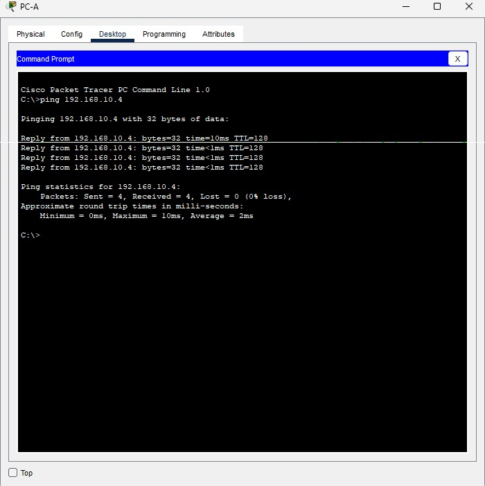

# Praktikum Jaringan Komputer - Judul 3: [Ganti dengan Judul Topik Anda]

Dokumen ini berisi langkah-langkah, konfigurasi, dan hasil dari praktikum jaringan komputer.

---

## Daftar Gambar dan Ilustrasi

Berikut adalah semua gambar yang digunakan dalam dokumentasi praktikum ini. Keterangan gambar (alt text) diambil dari nama file gambar.

### Topologi Jaringan

### Ping PC - A Berhasil

Konfigurasi Router A

#### Konfigurasi Router B

#### Konfigurasi PC Client

### Hasil Pengujian

#### Hasil Tes Ping

#### Tabel Routing

---
