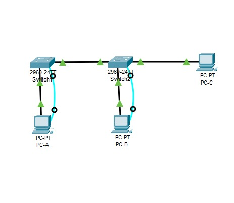
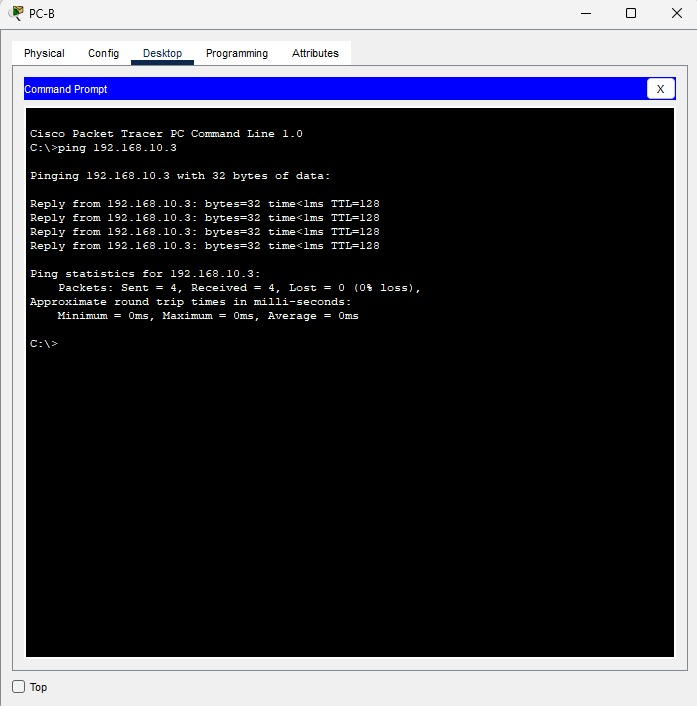
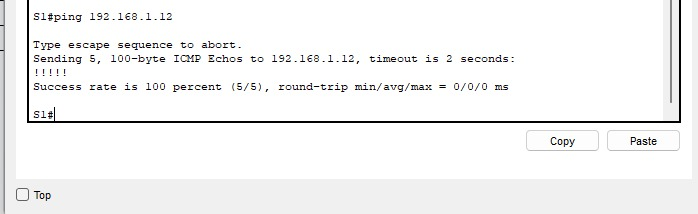

# Praktikum Jaringan Komputer - Judul 3
<li>Nama : MIchael Deffrans C</li>
<li>NPM : 2315061087</li>
<li>Kelompok : PJK-A</li>

Dokumen ini berisi langkah-langkah, konfigurasi, dan hasil dari praktikum jaringan komputer.

---

Link Video Youtube : https://youtu.be/wpmi-s7Pjqk

## Daftar Gambar dan Ilustrasi

Berikut adalah semua gambar yang digunakan dalam dokumentasi praktikum ini. Keterangan gambar (alt text) diambil dari nama file gambar.

### Topologi Jaringan

### Ping PC - A 

Ping melalui PC-A Berhasil

#### PING PC-B

Ping melalui PC-B Berhasil

#### Pinf PC-C

Ping melalui PC-C Berhasil

#### Hasil Tes Ping Switch

---
